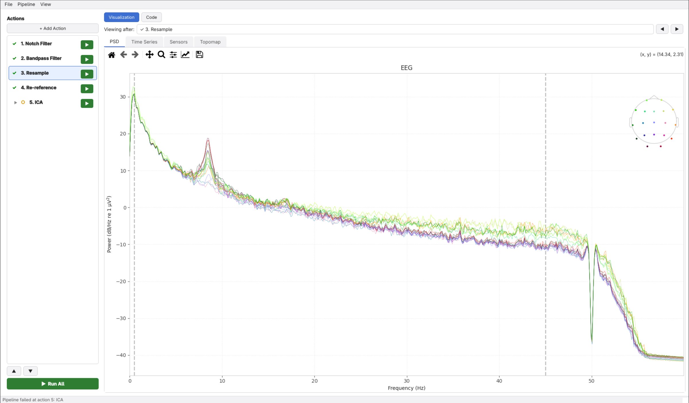
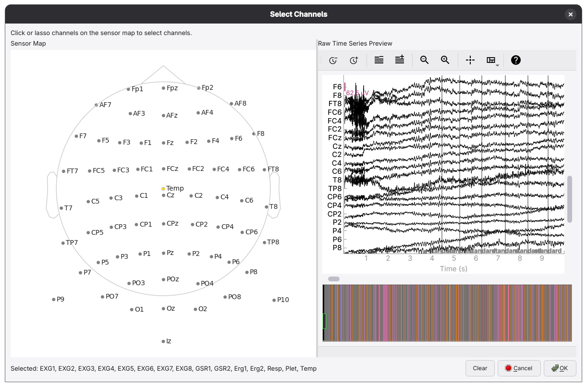

# MNETAPE
*An MNE Tool for Analyzing and Preprocessing EEG*

A graphical EEG preprocessing tool built on [MNE-Python](https://mne.tools).
This tool provides interactive pipeline assembly, per-step results inspection, and real-time clean MNE code generation.



## Features

- **Visual pipeline builder**: add, reorder, and configure preprocessing steps from the GUI.
- **Live code panel**: every action renders as clean MNE code. Edit the code directly and the UI stays in sync.
- **Bidirectional sync**: changes in the GUI update the code; manual edits to the code update the GUI.

## Workflow

### 1. Open a recording

*File > Open EEG File*.

Supported formats: `.fif`, `.edf`, `.bdf`, `.gdf`, `.vhdr`, `.set`, `.cnt`, `.mff`.

### 2. Build a pipeline

Click **+ Add Action** to append a preprocessing step. Double-click a step to configure its parameters.
The steps can be reordered.

### 3. Run

Click **Run All**. Steps execute in order and the visualization panel updates after each one.
Individual steps can be run from the right-click context menu.

Reordering steps or changing parameters invalidate downstream steps.

### 4. Inspect the code


Switch to the Code panel to see the full MNE script generated by the pipeline. <br>
Every parameter choice is reflected as a literal keyword argument. <br>
Edit the script directly; the action list updates automatically to reflect the changes.

### 5. Save

*Pipeline > Save Pipeline* writes a `.py` script. The file is a valid, standalone Python script.

Reload it later with *Pipeline > Load Pipeline* to restore the exact pipeline state.

## Installation

```bash
# Clone the repository
git clone https://github.com/zatomos/MNETAPE.git
cd mnetape

# With uv
uv sync

# With pip
pip install -e .
```

## Requirements

- Python 3.12+
- [MNE-Python](https://mne.tools)
- [uv](https://docs.astral.sh/uv/) (recommended) or pip

## Running

```bash
mnetape
```

## Available preprocessing actions

| Action            | Description                                                      |
|-------------------|------------------------------------------------------------------|
| Bandpass Filter   | High- and low-pass filter                                        |
| Notch Filter      | Line-noise removal                                               |
| Resample          | Change sampling frequency                                        |
| Set Reference     | Re-reference to electrode(s) or average                          |
| Interpolate       | Interpolate bad channels                                         |
| Drop Channels     | Permanently remove selected channels                             |
| Set Channel Types | Assign types to channels                                         |
| ICA               | Fit ICA, auto-classify artefact components, and inspect manually |




## Project structure

```
src/mnetape/
├── actions/        # Plugin-based action registry - see actions/README.md
├── core/           # Data I/O, execution engine, code generation - see core/README.md
└── gui/            # Qt6 interface (controllers, panels, dialogs) - see gui/README.md
```

## Acknowledgements
Screenshots use the following dataset:

> Andreas Miltiadous, Katerina D. Tzimourta, Theodora Afrantou, Panagiotis Ioannidis, Nikolaos Grigoriadis,
Dimitrios G. Tsalikakis, Pantelis Angelidis, Markos G. Tsipouras, Evripidis Glavas, Nikolaos Giannakeas, and
Alexandros T. Tzallas (2024). A dataset of EEG recordings from: Alzheimer's disease, Frontotemporal dementia and
Healthy subjects. OpenNeuro. [Dataset] doi: doi:10.18112/openneuro.ds004504.v1.0.8