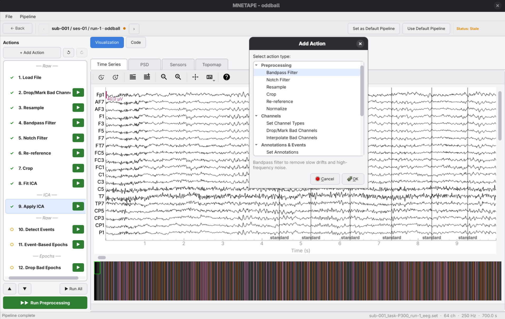
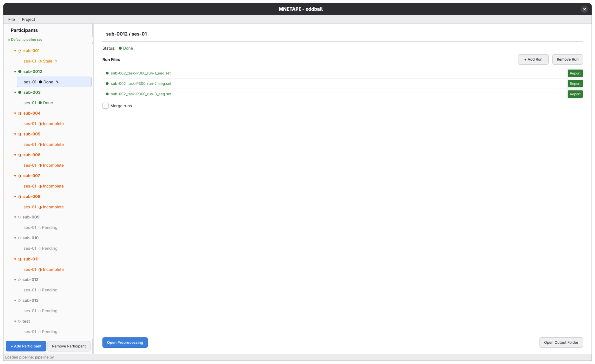
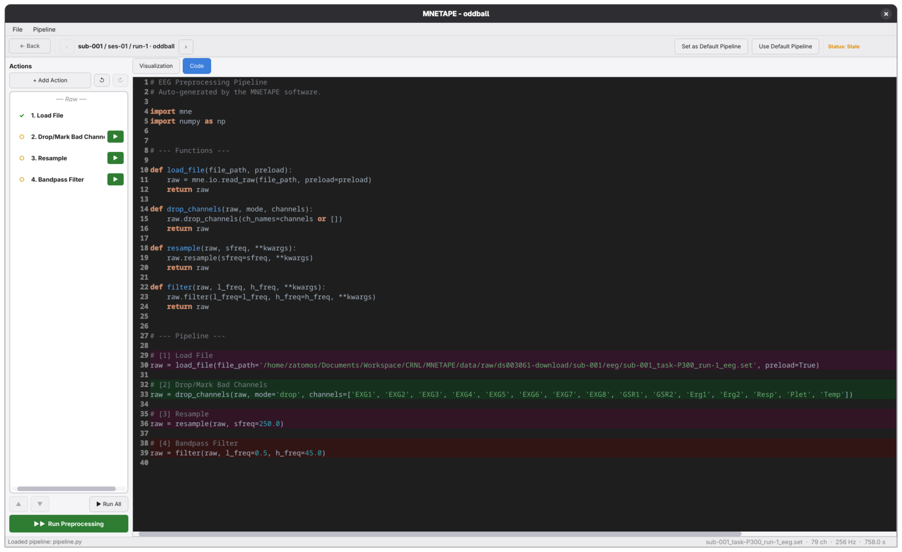
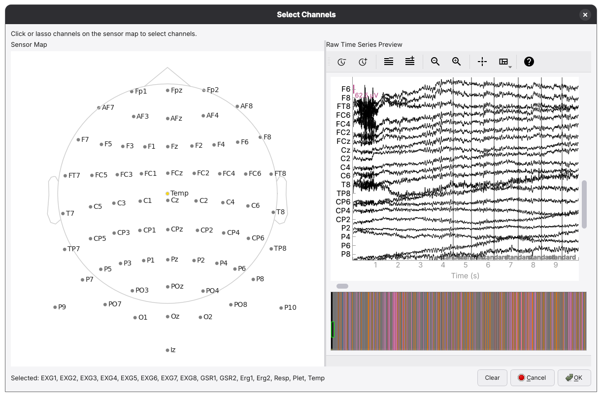

<div align="center">


# MNETAPE
*An MNE Tool for Analyzing and Preprocessing EEG*

[](https://www.python.org/)
[](https://www.riverbankcomputing.com/software/pyqt/)
[](https://www.gnu.org/licenses/gpl-3.0)

</div>

A graphical EEG preprocessing tool built on [MNE-Python](https://mne.tools).
MNETAPE lets you build preprocessing pipelines visually, inspect results step-by-step, and quickly export Python scripts.




## Features

- **Project-based workflow**: organize work by participant, session, and run; import directly from BIDS datasets.
- **Visual pipeline builder**: add, configure, reorder, and run preprocessing steps from a GUI. Visualize the EEG data after every pipeline step.
- **Bidirectional code editor**: the action list and the Python script stay in sync — edit either one and the other updates automatically.
- **Default and per-session pipelines**: share a common pipeline across all participants; override it per session as needed.

## Workflow

### 1. Create or open a project

Use **File > New Project…** or **File > Open Project…**.
Add participants manually or import a BIDS dataset (**Project > Import BIDS Dataset…**).



### 2. Open preprocessing for a run

Double-click a run in the project page to open it in the preprocessing view.
If the project has a default pipeline it is loaded automatically.

### 3. Build a pipeline

Add actions from the action list. Each action has a configuration dialog with a **Basic** and an **Advanced** tab.
Use the code panel to inspect the generated script or edit it directly. Changes are reflected back in the action list.

### 4. Set session as default
If you want to reuse the current session's pipeline for other sessions, set it as the project default. Any session without a custom pipeline will load the default pipeline when opened.


### 5. Run and inspect

Run the full pipeline (**Pipeline > Run All**, `Ctrl+Shift+Enter`) or step through it one action at a time.
The visualization panel shows plots for the current step's data.

If you run the full pipeline, the final data object will be saved to disk in the output directory of the current session.
A QC HTML report is generated alongside the output file and the session status will be set to **Done**.




## Available actions

| Group                | Actions                                                                               |
|----------------------|---------------------------------------------------------------------------------------|
| Preprocessing        | Bandpass Filter, Notch Filter, Resample, Crop, Normalize                              |
| Channel management   | Set Montage, Re-reference, Set Channel Types, Drop Channels, Interpolate Bad Channels |
| Events & annotations | Set Annotations, Detect Events                                                        |
| Epochs & evoked      | Fixed-Length Epochs, Event-Based Epochs, Drop Bad Epochs, Average Epochs              |
| ICA                  | Fit ICA, Apply ICA                                                                    |



## Supported input formats

`.fif`, `.fif.gz`, `.edf`, `.bdf`, `.gdf`, `.vhdr`, `.set`, `.cnt`, `.mff`

## Installation

```bash
git clone https://github.com/zatomos/MNETAPE.git
cd MNETAPE

# Recommended
uv sync

# Alternative
pip install -e .
```

**Requirements:** Python 3.12+, [MNE-Python](https://mne.tools), [uv](https://docs.astral.sh/uv/) (recommended)

## Running

```bash
# If installed in the active environment
mnetape

# Or directly from source
uv run mnetape
```

## Repository structure

```text
src/mnetape/
├── app.py         # Entry point
├── actions/       # Action plugin system (see actions/README.md)
├── core/          # Models, execution, code generation, project state (see core/README.md)
└── gui/           # Qt6 pages, controllers, dialogs, and panels (see gui/README.md)
```

## Acknowledgements

Screenshots use the following dataset:

> Arnaud Delorme (2022). EEG data from an auditory oddball task.
> OpenNeuro. [Dataset] doi: doi:10.18112/openneuro.ds003061.v1.1.2
